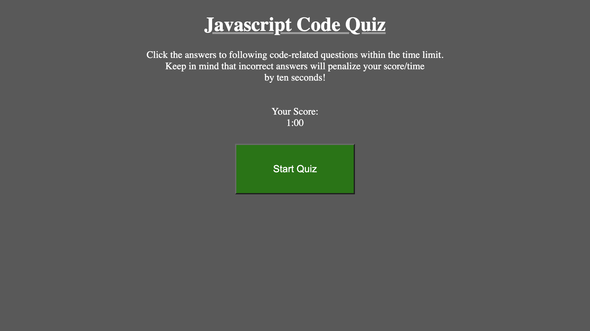

# Javascript-Coding-Quiz 

 

## User Story

 

As a coding bootcamp student,
I want to take a timed quiz on JavaScript fundamentals that stores high scores
so that I can gauge my progress compared to my peers.

 
  
## Acceptance Criteria

 

When I am taking a code quiz, I click the start button and a timer starts, and I am presented with a question.
When I answer a question, I am presented with another question.
When I answer a question incorrectly, time is subtracted from the clock.
When all questions are answered or the timer reaches 0, the game is over.
When the game is over, I can save my initials and score.

 

## See Deployed Site Here: https://codyalmand.github.io/Javascript-Coding-Quiz/

